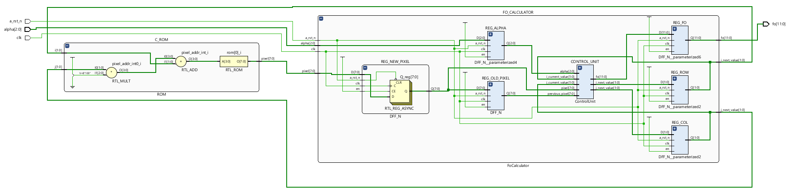

# Fo Coefficient Calculator for Image Elaboration System


University project for **Electronics and Communication Systems** course (MSc Computer Engineering at University of Pisa, A.Y. 2023-24)   

In an **Image Elaboration System**, it is necessary to calculate the **Fo Coefficient**, with the following formula:   
    **fo = α · y(i − 1, j) + (1 − α) · y(i, j)**   
where:
- y(i − 1, j) and y(i, j) are pixels of the matrix y, which represents an image;   
- y(i, j) ∈ I, y(i, j) ∈ [0, 255];    
- α is a parameter chosen by the user. α ∈ (0, 1)   

The goal of this Project is to design a digital circuit for implementing such operation.  
- The value **α** in fixed-point arithmetic is represented on 3-bits.     
- The output **f0** is represented in 12 fixed-point arithmetic.   

The Schema of the circuit, obtained through Vivado’s RTL analysis is the following:



## Structure of the repository

```
Fo-Coefficient-Calculator-for-Image-Elaboration-System
│
├── conf_files
│
├── docs
│
├── modelsim
│
├── script
│   └── results
│
├── src
│
├── tb
│
└── vivado
```

## Author
- [Fabrizio Lanzillo](https://github.com/FabrizioLanzillo)